# Kingsley Documentation Of Project 4

In this Project, i am going to implement a simple Book Register web form using MEAN stack.

## Step 1: Install NodeJs

`sudo apt update`

`sudo apt upgrade -y`

`sudo systemctl status`

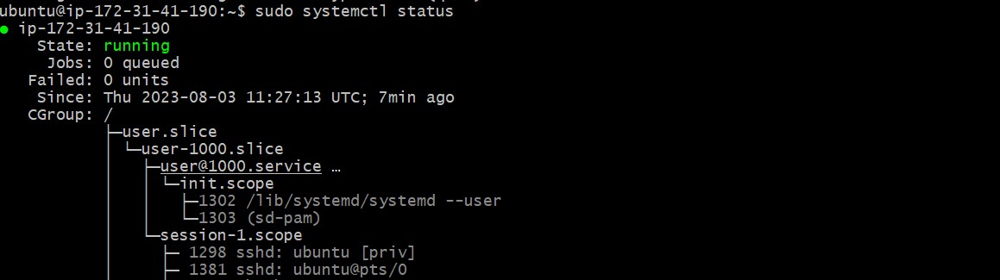

*Add certificates*

`sudo apt -y install curl dirmngr apt-transport-https lsb-release ca-certificates

curl -sL https://deb.nodesource.com/setup_18.x | sudo -E bash -`

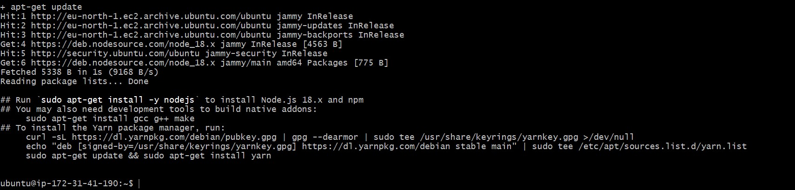

*Install Nodejs*

`sudo apt install -y nodejs`

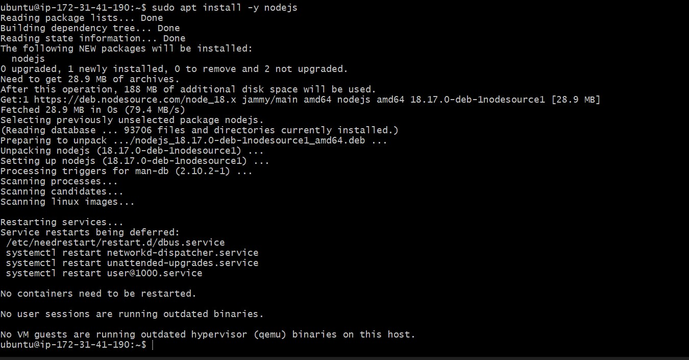

## Step 2 - Install MongoDB

*Import the public key used by the package management system*

`sudo apt-get install gnupg curl`

*Issue the following command to import the MongoDB public GPG Key from 
https://pgp.mongodb.com/server-6.0.asc
:*

`curl -fsSL https://pgp.mongodb.com/server-6.0.asc | \
   sudo gpg -o /usr/share/keyrings/mongodb-server-6.0.gpg \
   --dearmor`

*Create a list file for MongoDB*

`echo "deb [ arch=amd64,arm64 signed-by=/usr/share/keyrings/mongodb-server-6.0.gpg ] https://repo.mongodb.org/apt/ubuntu jammy/mongodb-org/6.0 multiverse" | sudo tee /etc/apt/sources.list.d/mongodb-org-6.0.list
`

*Reload local package database*

`sudo apt-get update`

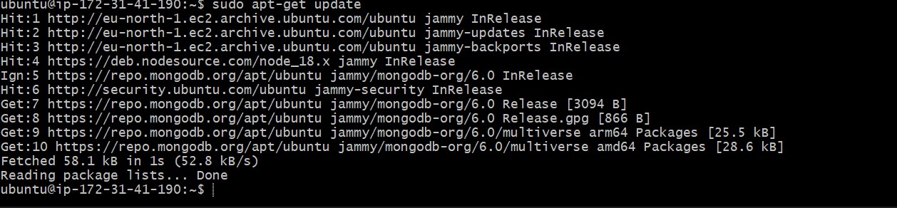

*Install the MongoDB packages*

`sudo apt-get install -y mongodb-org`

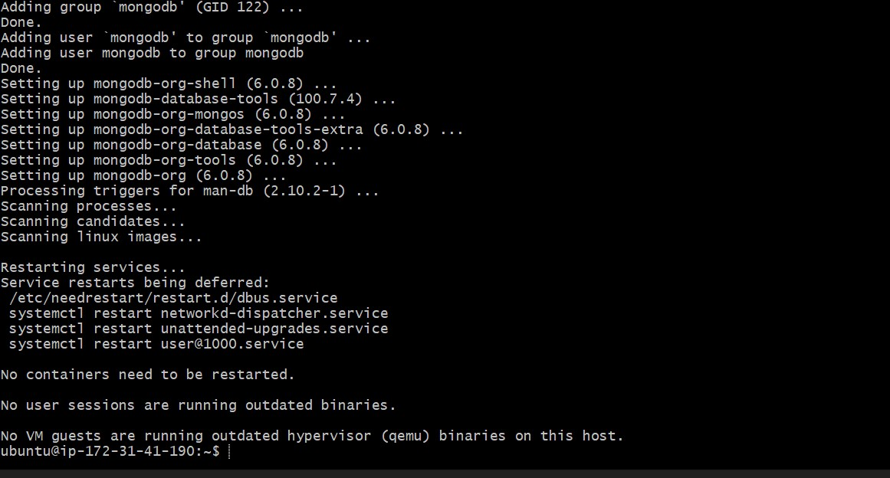

*Start and Enable The Mongod Service*

`sudo systemctl start mongod`

`sudo systemctl status mongod`

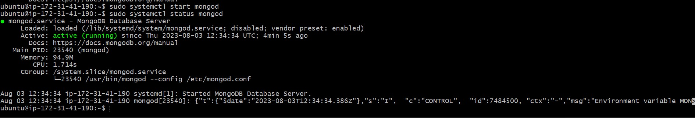

Update Version of NodeJS

*Installing Node.js with Apt Using a NodeSource PPA*

`curl -sL https://deb.nodesource.com/setup_18.x -o /tmp/nodesource_setup.sh`

*Check Nodejs content with test editor*

`nano /tmp/nodesource_setup.sh`

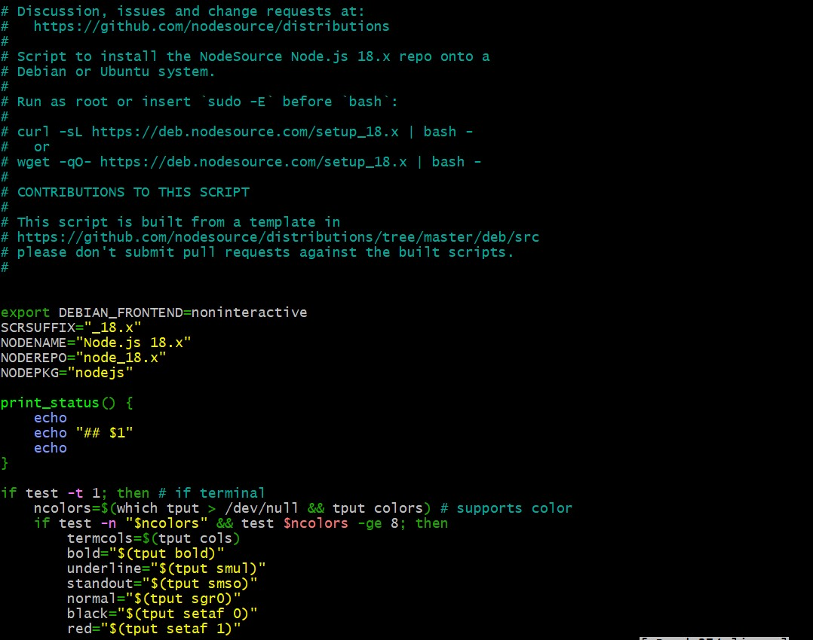

*Run the script with sudo*

`sudo bash /tmp/nodesource_setup.sh`

The PPA will be added to your configuration and your local package cache will be updated automatically. You can now install the Node.js package in the same way you did in the previous section

`sudo apt install nodejs`

*Nodejs version update*

`node -v`

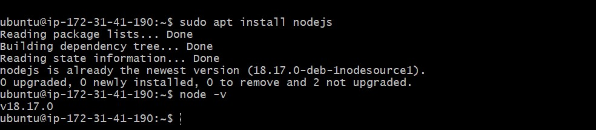

*Install body-parser package*

`sudo npm install body-parser`

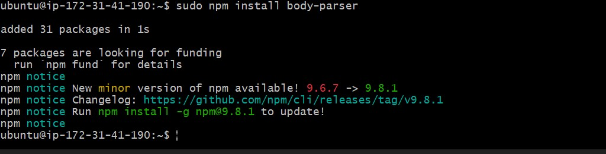

*Create a folder named ‘Books’*

`mkdir Books && cd Books`

*In the Books directory, Initialize npm project*

`npm init`

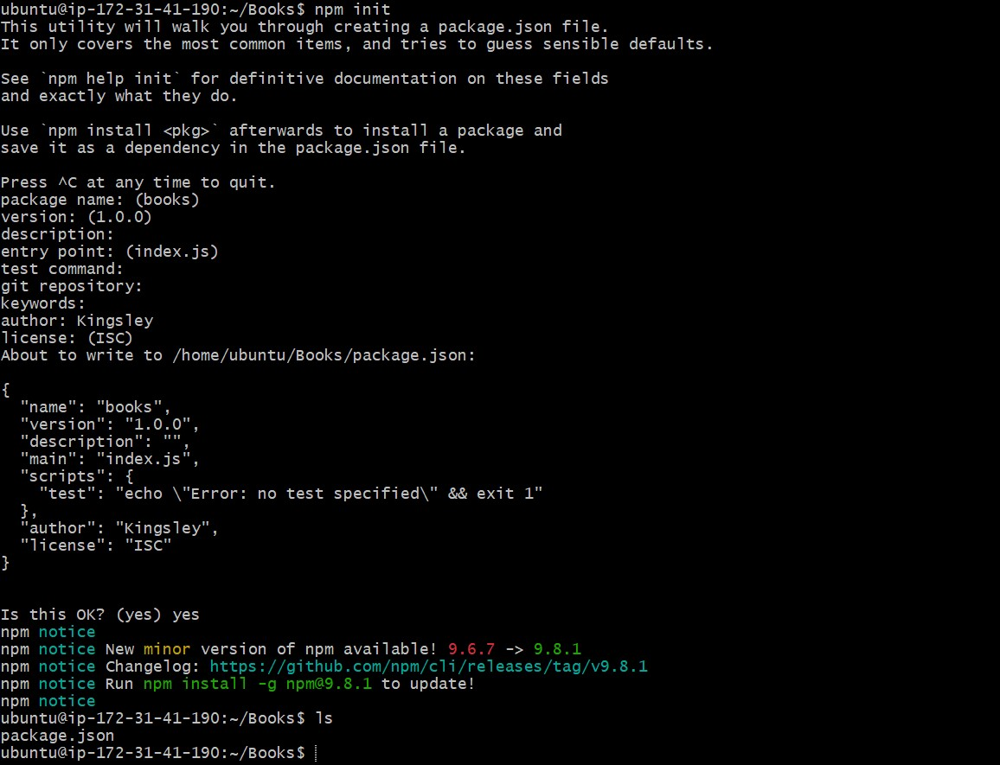

*Add a file to it named server.js*

`sudo vi server.js`

*Copy and paste the web server code below into the server.js file*

`var express = require('express');
var bodyParser = require('body-parser');
var app = express();
app.use(express.static(__dirname + '/public'));
app.use(bodyParser.json());
require('./apps/routes')(app);
app.set('port', 3300);
app.listen(app.get('port'), function() {
    console.log('Server up: http://localhost:' + app.get('port'));
});`

## Step 3 - Install Express and set up routes to the server

*Install Express and Mongoose Packages*

`sudo npm install express mongoose`

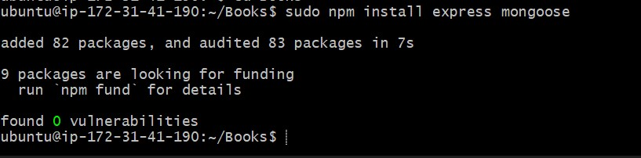

*In ‘Books’ folder, create a folder named apps*

`mkdir apps && cd apps`

*Create a file named routes.js*

`sudo vi routes.js`

*Copy and paste the code below into routes.js*

`const Book = require('./models/book');

module.exports = function(app){
  app.get('/book', function(req, res){
    Book.find({}).then(result => {
      res.json(result);
    }).catch(err => {
      console.error(err);
      res.status(500).send('An error occurred while retrieving books');
    });
  });

  app.post('/book', function(req, res){
    const book = new Book({
      name: req.body.name,
      isbn: req.body.isbn,
      author: req.body.author,
      pages: req.body.pages
    });
    book.save().then(result => {
      res.json({
        message: "Successfully added book",
        book: result
      });
    }).catch(err => {
      console.error(err);
      res.status(500).send('An error occurred while saving the book');
    });
  });

  app.delete("/book/:isbn", function(req, res){
    Book.findOneAndRemove(req.query).then(result => {
      res.json({
        message: "Successfully deleted the book",
        book: result
      });
    }).catch(err => {
      console.error(err);
      res.status(500).send('An error occurred while deleting the book');
    });
  });

  const path = require('path');
  app.get('*', function(req, res){
    res.sendFile(path.join(__dirname, 'public', 'index.html'));
  });
};`

*In the ‘apps’ folder, create a folder named models*

`mkdir models && cd models`

*Create a file named book.js*

`sudo vi book.js`

*Copy and paste the code below into ‘book.js’*

`var mongoose = require('mongoose');
var dbHost = 'mongodb://localhost:27017/test';
mongoose.connect(dbHost);
mongoose.connection;
mongoose.set('debug', true);
var bookSchema = mongoose.Schema( {
  name: String,
  isbn: {type: String, index: true},
  author: String,
  pages: Number
});
var Book = mongoose.model('Book', bookSchema);
module.exports = mongoose.model('Book', bookSchema);`

## Step 4 - Access the routes with AngularJS

*Change the directory back to ‘Books’*

`cd ../..`

*Create a folder named public*

`mkdir public && cd public`

*Add a file named script.js*

`sudo vi script.js`

*Copy and paste the Code below (controller configuration defined) into the script.js file*

`var app = angular.module('myApp', []);
app.controller('myCtrl', function($scope, $http) {
  $http( {
    method: 'GET',
    url: '/book'
  }).then(function successCallback(response) {
    $scope.books = response.data;
  }, function errorCallback(response) {
    console.log('Error: ' + response);
  });
  $scope.del_book = function(book) {
    $http( {
      method: 'DELETE',
      url: '/book/:isbn',
      params: {'isbn': book.isbn}
    }).then(function successCallback(response) {
      console.log(response);
    }, function errorCallback(response) {
      console.log('Error: ' + response);
    });
  };
  $scope.add_book = function() {
    var body = '{ "name": "' + $scope.Name + 
    '", "isbn": "' + $scope.Isbn +
    '", "author": "' + $scope.Author + 
    '", "pages": "' + $scope.Pages + '" }';
    $http({
      method: 'POST',
      url: '/book',
      data: body
    }).then(function successCallback(response) {
      console.log(response);
    }, function errorCallback(response) {
      console.log('Error: ' + response);
    });
  };
});`

*In public folder, create a file named index.html*

`sudo vi index.html`

*Copy and paste the code below into index.html file*

`<!doctype html>
<html ng-app="myApp" ng-controller="myCtrl">
  <head>
    
    
  </head>
  <body>
    

      <table>
        <tr>
          <td>Name:</td>
          <td><input type="text" ng-model="Name"></td>
        </tr>
        <tr>
          <td>Isbn:</td>
          <td><input type="text" ng-model="Isbn"></td>
        </tr>
        <tr>
          <td>Author:</td>
          <td><input type="text" ng-model="Author"></td>
        </tr>
        <tr>
          <td>Pages:</td>
          <td><input type="number" ng-model="Pages"></td>
        </tr>
      </table>
      <button ng-click="add_book()">Add</button>
    

    

    

      <table>
        <tr>
          <th>Name</th>
          <th>Isbn</th>
          <th>Author</th>
          <th>Pages</th>

        </tr>
        <tr ng-repeat="book in books">
          <td>{{book.name}}</td>
          <td>{{book.isbn}}</td>
          <td>{{book.author}}</td>
          <td>{{book.pages}}</td>

          <td><input type="button" value="Delete" data-ng-click="del_book(book)"></td>
        </tr>
      </table>
    

  </body>
</html>`

*Change the directory back up to Books*

`cd ..`

*Start the server by running this command*

`node server.js`

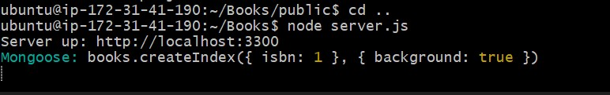

*Accessing server over the web browser with port 3300 open in the security group on AWS*

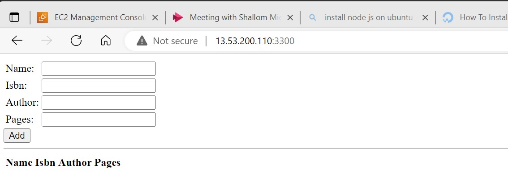

*edit book info*

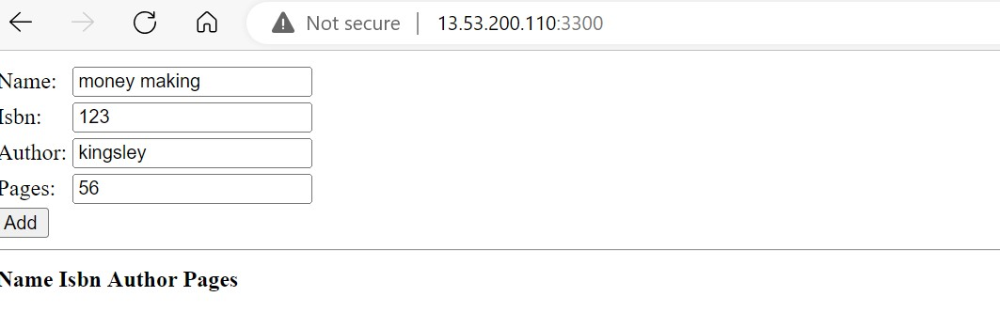

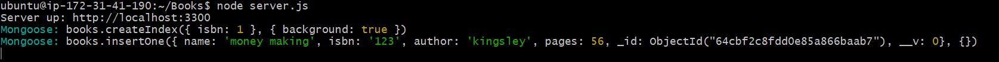

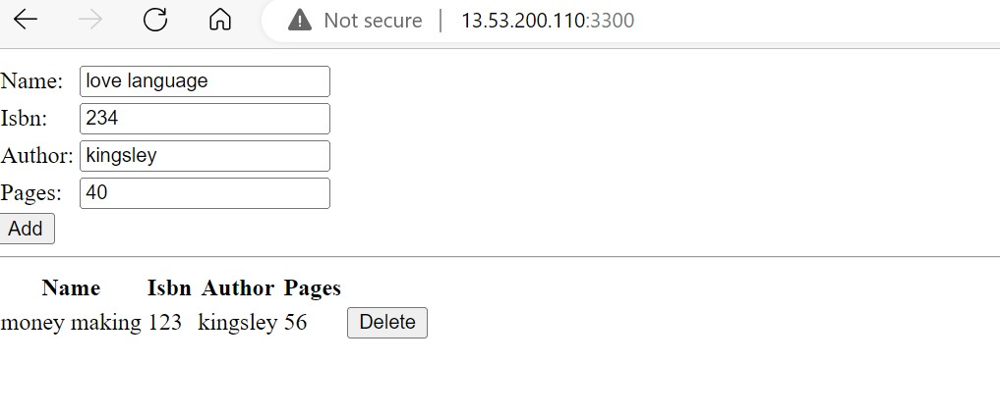

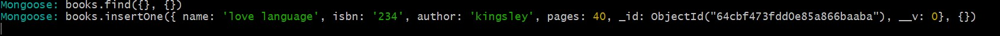

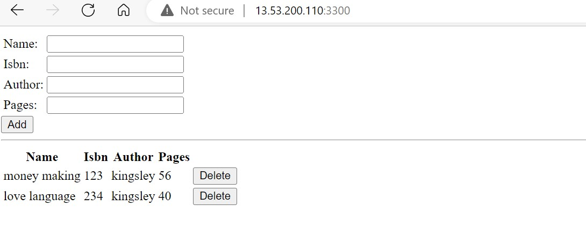

