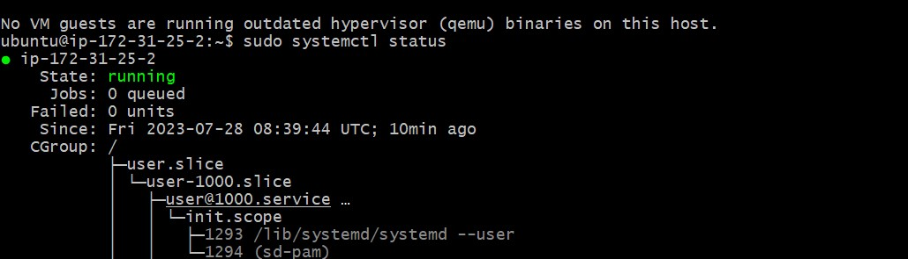
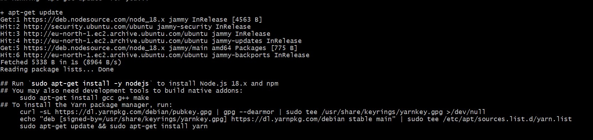
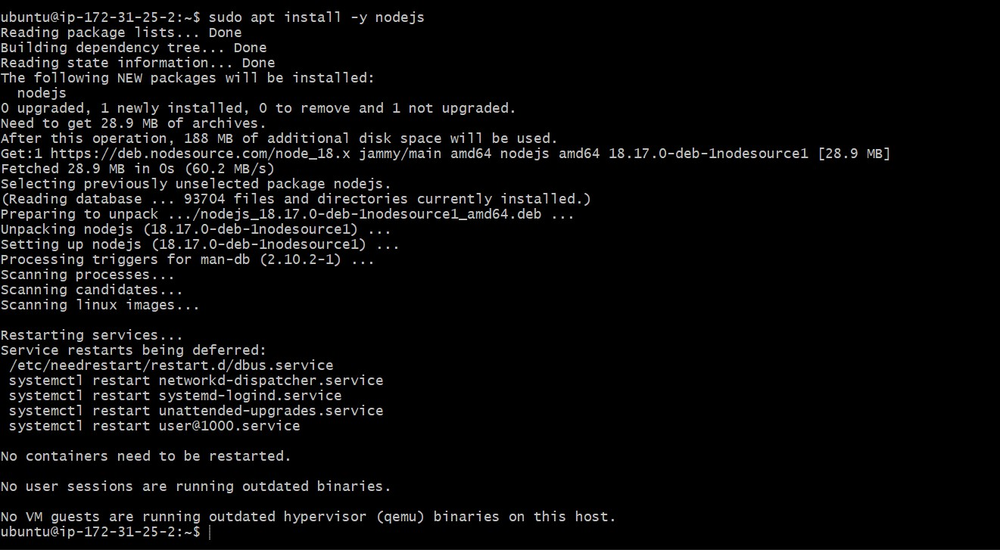

# Kingsley Documentation Of Project 4

In this Project, i am going to implement a simple Book Register web form using MEAN stack.

## Step 1: Install NodeJs

`sudo apt update`

`sudo apt upgrade -y`

`sudo systemctl status`

*Add certificates*

`sudo apt -y install curl dirmngr apt-transport-https lsb-release ca-certificates

curl -sL https://deb.nodesource.com/setup_18.x | sudo -E bash -`

*Install Nodejs*

`sudo apt install -y nodejs`

## Step 2 - Install MongoDB

`sudo apt-get install gnupg curl`

*Issue the following command to import the MongoDB public GPG Key from 
https://pgp.mongodb.com/server-6.0.asc
:*

`curl -fsSL https://pgp.mongodb.com/server-6.0.asc | \
   sudo gpg -o /usr/share/keyrings/mongodb-server-6.0.gpg \
   --dearmor`

